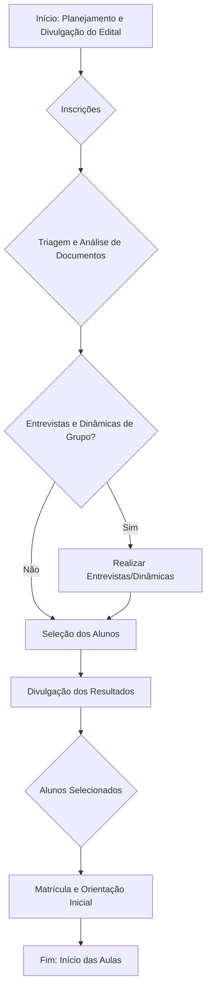

# Documentação de Contato - Projeto Padroeira Solidária

Este documento visa padronizar e facilitar o contato com fornecedores, colaboradores e alunos do Projeto Padroeira Solidária, garantindo clareza, eficiência e profissionalismo em todas as interações.

## 1. Contato com Fornecedores

### 1.1. Modelo de E-mail/Carta de Primeiro Contato

Este modelo pode ser utilizado para iniciar a comunicação com potenciais fornecedores, apresentando o Projeto Padroeira Solidária e expressando o interesse em estabelecer uma parceria.

```
Assunto: Convite para Parceria: Projeto Padroeira Solidária

Prezado(a) [Nome do Contato do Fornecedor ou Departamento Comercial],

Esperamos que este e-mail o(a) encontre bem.

Meu nome é [Seu Nome/Nome do Representante do Projeto] e faço parte do Projeto Padroeira Solidária, uma organização sem fins lucrativos que há 22 anos atua em Arapiraca, Alagoas, transformando a realidade de jovens em situação de vulnerabilidade através da educação e qualificação profissional.

Nosso projeto oferece cursos profissionalizantes gratuitos, mentoria e suporte na inserção de jovens no mercado de trabalho, contribuindo significativamente para o desenvolvimento social e econômico da região. Para a continuidade e expansão de nossas atividades, buscamos parceiros que compartilhem de nossos valores e que possam nos apoiar com produtos ou serviços de qualidade.

Gostaríamos de explorar a possibilidade de estabelecer uma parceria com sua empresa, [Nome da Empresa do Fornecedor], para [descrever brevemente o tipo de produto/serviço que o projeto busca, ex: fornecimento de materiais didáticos, serviços de alimentação, transporte, etc.]. Acreditamos que esta colaboração pode ser mutuamente benéfica, permitindo que sua empresa associe sua marca a uma causa social relevante e contribua diretamente para o futuro de centenas de jovens.

Anexamos a este e-mail uma breve apresentação institucional do Projeto Padroeira Solidária para que você possa conhecer mais sobre nosso trabalho e impacto.

Teríamos grande satisfação em agendar uma breve conversa para apresentar nossas necessidades em mais detalhes e discutir como sua empresa pode se engajar em nosso projeto.

Por favor, nos informe sua disponibilidade ou se há outra pessoa em sua equipe mais indicada para esta conversa.

Agradecemos imensamente sua atenção e interesse em fazer a diferença.

Atenciosamente,

[Seu Nome/Nome do Representante do Projeto]
[Seu Cargo/Departamento]
Projeto Padroeira Solidária
[Telefone de Contato]
[E-mail de Contato]
[Site do Projeto (se houver)]
```

### 1.2. Formulário de Cadastro de Fornecedores

Este formulário pode ser utilizado para coletar informações essenciais de novos fornecedores, facilitando o registro e a organização dos dados.

```
# Formulário de Cadastro de Fornecedores - Projeto Padroeira Solidária

**Dados da Empresa:**

*   **Razão Social:** __________________________________________________
*   **Nome Fantasia:** __________________________________________________
*   **CNPJ:** __________________________________________________
*   **Inscrição Estadual/Municipal:** ____________________________________
*   **Endereço Completo:** ______________________________________________
    *   **CEP:** ___________
    *   **Cidade:** ___________ **Estado:** ___________
*   **Telefone Comercial:** ____________________________________________
*   **E-mail Comercial:** ____________________________________________
*   **Site (se houver):** ____________________________________________

**Dados do Contato Principal:**

*   **Nome Completo:** __________________________________________________
*   **Cargo:** __________________________________________________
*   **Telefone:** __________________________________________________
*   **E-mail:** __________________________________________________

**Informações Bancárias (para pagamentos):**

*   **Banco:** __________________________________________________
*   **Agência:** __________________________________________________
*   **Conta Corrente/Poupança:** ____________________________________
*   **Tipo de Conta:** [ ] Corrente [ ] Poupança
*   **Titular da Conta:** ____________________________________________
*   **CPF/CNPJ do Titular:** ____________________________________________

**Produtos/Serviços Oferecidos:**

*   [ ] Materiais Didáticos
*   [ ] Materiais de Escritório
*   [ ] Serviços de Alimentação (Lanches/Refeições)
*   [ ] Serviços de Transporte
*   [ ] Serviços de Impressão/Gráfica
*   [ ] Serviços de Manutenção (Geral/Equipamentos)
*   [ ] Serviços de Limpeza
*   [ ] Outros (especificar): ____________________________________________

**Observações Adicionais:**

____________________________________________________________________
____________________________________________________________________

**Data de Preenchimento:** ____/____/________

**Assinatura do Representante do Fornecedor:**

____________________________________________________________________
```

### 1.3. Diretrizes para Aquisição de Produtos e Serviços

Para garantir a transparência e a eficiência na aquisição de produtos e serviços, as seguintes diretrizes devem ser seguidas:

1.  **Necessidade:** Toda aquisição deve ser justificada por uma necessidade real do projeto, alinhada aos objetivos e atividades planejadas.
2.  **Cotação:** Para aquisições acima de um valor pré-determinado (ex: R$ 500,00), é recomendável obter no mínimo 3 cotações de diferentes fornecedores para garantir o melhor custo-benefício.
3.  **Qualidade:** Priorizar fornecedores que ofereçam produtos e serviços de qualidade comprovada, mesmo que o custo seja ligeiramente superior, visando a durabilidade e a eficácia.
4.  **Prazo:** Considerar a capacidade do fornecedor em cumprir os prazos de entrega ou execução, especialmente para itens críticos.
5.  **Documentação:** Manter registro de todas as cotações, pedidos, notas fiscais e comprovantes de pagamento para fins de prestação de contas e auditoria.
6.  **Sustentabilidade:** Sempre que possível, priorizar fornecedores com práticas sustentáveis e responsabilidade social.

## 2. Contato com Colaboradores (Voluntários e Equipe)

### 2.1. Modelo de E-mail de Boas-Vindas para Novos Colaboradores

Este e-mail pode ser enviado a novos voluntários ou membros da equipe, dando as boas-vindas e fornecendo informações iniciais importantes.

```
Assunto: Bem-vindo(a) ao Projeto Padroeira Solidária!

Prezado(a) [Nome do Colaborador],

É com grande alegria que damos as boas-vindas ao Projeto Padroeira Solidária! Sua decisão de se juntar à nossa equipe é um passo muito importante para continuarmos transformando vidas através da educação em Arapiraca.

Sua contribuição como [Voluntário/Membro da Equipe - especificar função, ex: mentor, professor, apoio administrativo] será fundamental para o sucesso de nossas atividades e para o desenvolvimento de nossos jovens.

Para que você se sinta mais à vontade e integrado(a) desde o início, preparamos algumas informações e próximos passos:

1.  **Seu Ponto de Contato:** Seu supervisor direto será [Nome do Supervisor], que estará à disposição para orientá-lo(a) em suas atividades e tirar suas dúvidas. Você pode contatá-lo(a) pelo e-mail [E-mail do Supervisor] ou telefone [Telefone do Supervisor].
2.  **Próxima Reunião/Treinamento:** Convidamos você para nossa reunião de integração/treinamento no dia [Data] às [Hora], no [Local]. Nesta reunião, você conhecerá melhor a equipe, aprofundará seus conhecimentos sobre o projeto e receberá as orientações específicas para sua função.
3.  **Materiais de Apoio:** Anexamos a este e-mail nosso Manual do Colaborador, que contém informações detalhadas sobre a missão, visão, valores, políticas internas e diretrizes de atuação do projeto. Por favor, leia-o com atenção.
4.  **Redes Sociais:** Siga-nos em nossas redes sociais ([Links para Instagram, Facebook]) para ficar por dentro de todas as nossas novidades e compartilhar nosso trabalho.

Estamos muito animados com sua chegada e temos certeza de que juntos faremos a diferença na vida de muitos jovens. Conte conosco para o que precisar!

Atenciosamente,

Equipe Projeto Padroeira Solidária
[Telefone Geral de Contato]
[E-mail Geral de Contato]
[Site do Projeto]
```

### 2.2. Checklist de Onboarding para Colaboradores

Este checklist auxilia na organização das etapas de integração de novos colaboradores, garantindo que todos os procedimentos sejam seguidos.

```
# Checklist de Onboarding para Colaboradores - Projeto Padroeira Solidária

**Nome do Colaborador:** ____________________________________________
**Função:** ____________________________________________
**Data de Início:** ____/____/________

**Etapas de Integração:**

*   [ ] Envio do E-mail de Boas-Vindas.
*   [ ] Envio do Manual do Colaborador.
*   [ ] Agendamento da Reunião de Integração/Treinamento.
*   [ ] Apresentação à equipe e supervisor direto.
*   [ ] Cadastro de dados pessoais (ver Formulário de Dados Pessoais).
*   [ ] Explicação sobre a missão, visão e valores do projeto.
*   [ ] Detalhamento das responsabilidades e expectativas da função.
*   [ ] Acesso a ferramentas e sistemas (se aplicável).
*   [ ] Entrega de materiais de trabalho (crachá, uniforme, etc. - se aplicável).
*   [ ] Orientação sobre políticas internas (código de conduta, segurança).
*   [ ] Esclarecimento de dúvidas.
*   [ ] Assinatura do Termo de Voluntariado/Contrato (se aplicável).

**Observações:**

____________________________________________________________________
____________________________________________________________________

**Responsável pelo Onboarding:** ____________________________________

**Data de Conclusão:** ____/____/________
```

### 2.3. Formulário de Dados Pessoais do Colaborador

Formulário para coleta de informações básicas dos colaboradores para fins de registro interno e comunicação.

```
# Formulário de Dados Pessoais do Colaborador - Projeto Padroeira Solidária

**Dados Pessoais:**

*   **Nome Completo:** __________________________________________________
*   **CPF:** __________________________________________________
*   **RG:** ___________________________ **Órgão Emissor:** ___________ **UF:** ____
*   **Data de Nascimento:** ____/____/________
*   **Nacionalidade:** ___________________________ **Naturalidade:** ___________ **UF:** ____
*   **Endereço Completo:** ______________________________________________
    *   **CEP:** ___________
    *   **Cidade:** ___________ **Estado:** ___________
*   **Telefone Celular:** ____________________________________________
*   **E-mail Pessoal:** ____________________________________________

**Dados de Contato de Emergência:**

*   **Nome Completo:** __________________________________________________
*   **Parentesco:** __________________________________________________
*   **Telefone:** __________________________________________________

**Informações Adicionais:**

*   **Formação Acadêmica:** ____________________________________________
*   **Áreas de Interesse para Voluntariado:** ______________________________
*   **Disponibilidade (dias/horários):** ____________________________________

**Observações:**

____________________________________________________________________
____________________________________________________________________

**Data de Preenchimento:** ____/____/________

**Assinatura do Colaborador:**

____________________________________________________________________
```

## 3. Contato com Alunos

### 3.1. Modelo de E-mail de Boas-Vindas para Alunos Selecionados

Este e-mail é enviado aos jovens que foram selecionados para participar dos cursos do Projeto Padroeira Solidária.

```
Assunto: Parabéns! Você foi selecionado(a) para o Projeto Padroeira Solidária!

Prezado(a) [Nome do Aluno],

É com imensa satisfação que informamos: você foi selecionado(a) para participar da [Número da Edição, ex: 23ª] edição do Projeto Padroeira Solidária! Parabéns por esta conquista!

Estamos muito felizes em tê-lo(a) conosco nesta jornada de aprendizado e transformação. Acreditamos em seu potencial e temos certeza de que este será um período de grande crescimento em sua vida.

Para darmos os próximos passos, por favor, atente-se às seguintes informações:

1.  **Reunião de Orientação:** Convidamos você e seus responsáveis (se for menor de idade) para uma reunião de orientação obrigatória no dia [Data] às [Hora], no [Local - ex: sede do projeto, sala de aula]. Nesta reunião, apresentaremos o cronograma completo do curso, as regras de participação e tiraremos todas as suas dúvidas.
2.  **Documentação Necessária:** Para efetivar sua matrícula, solicitamos que traga os seguintes documentos originais e cópias na reunião de orientação:
    *   RG e CPF (do aluno e do responsável, se menor)
    *   Comprovante de Residência
    *   Declaração de Matrícula ou Histórico Escolar (comprovando ser egresso/estudante da rede pública)
    *   [Outros documentos específicos, se houver]
3.  **Início das Aulas:** As aulas do curso de [Nome do Curso] terão início no dia [Data de Início das Aulas], no [Local das Aulas]. O cronograma detalhado será entregue na reunião de orientação.

Sua dedicação e comprometimento serão essenciais para aproveitar ao máximo esta oportunidade. Conte com toda a equipe do Projeto Padroeira Solidária para apoiá-lo(a) em sua jornada.

Em caso de dúvidas, entre em contato conosco pelo telefone [Telefone de Contato] ou e-mail [E-mail de Contato].

Seja muito bem-vindo(a) ao Projeto Padroeira Solidária!

Atenciosamente,

Equipe Projeto Padroeira Solidária
[Telefone de Contato]
[E-mail de Contato]
[Site do Projeto]
```

### 3.2. Formulário de Inscrição/Matrícula de Alunos

Este formulário é utilizado para coletar os dados dos alunos no momento da inscrição ou matrícula, garantindo que todas as informações necessárias sejam registradas.

```
# Formulário de Inscrição/Matrícula de Alunos - Projeto Padroeira Solidária

**Dados Pessoais do Aluno:**

*   **Nome Completo:** __________________________________________________
*   **CPF:** __________________________________________________
*   **RG:** ___________________________ **Órgão Emissor:** ___________ **UF:** ____
*   **Data de Nascimento:** ____/____/________
*   **Idade:** ___________
*   **Nacionalidade:** ___________________________ **Naturalidade:** ___________ **UF:** ____
*   **Endereço Completo:** ______________________________________________
    *   **CEP:** ___________
    *   **Cidade:** ___________ **Estado:** ___________
*   **Telefone Celular:** ____________________________________________
*   **E-mail Pessoal:** ____________________________________________

**Dados Escolares:**

*   **Escola de Origem (se egresso):** ____________________________________
*   **Rede de Ensino:** [ ] Pública [ ] Privada
*   **Série/Ano (se estudante):** ____________________________________
*   **Disponibilidade de Horário:** [ ] Manhã [ ] Tarde [ ] Integral

**Dados do Responsável (se o aluno for menor de idade):**

*   **Nome Completo do Responsável:** ____________________________________
*   **Parentesco:** __________________________________________________
*   **CPF do Responsável:** ____________________________________________
*   **Telefone do Responsável:** ________________________________________

**Informações Adicionais:**

*   **Como conheceu o Projeto Padroeira Solidária?** ______________________
*   **Qual curso você tem interesse?** ____________________________________
*   **Possui alguma necessidade especial?** [ ] Sim [ ] Não
    *   Se sim, qual? __________________________________________________

**Termo de Consentimento:**

Declaro que as informações fornecidas neste formulário são verdadeiras e autorizo o Projeto Padroeira Solidária a utilizá-las para fins de cadastro e comunicação relacionados ao projeto.

**Data de Preenchimento:** ____/____/________

**Assinatura do Aluno:**

____________________________________________________________________

**Assinatura do Responsável (se menor):**

____________________________________________________________________
```

### 3.3. Termo de Consentimento para Uso de Imagem e Voz (Modelo)

Este termo é fundamental para garantir a permissão legal para o uso da imagem e voz dos alunos em materiais de divulgação do projeto.

```
# Termo de Consentimento para Uso de Imagem e Voz - Projeto Padroeira Solidária

Eu, [Nome Completo do Aluno], [Nacionalidade], [Estado Civil], [Profissão], portador(a) do RG nº [Número do RG] e CPF nº [Número do CPF], residente e domiciliado(a) na [Endereço Completo],

OU (se menor de idade)

Eu, [Nome Completo do Responsável], [Nacionalidade], [Estado Civil], [Profissão], portador(a) do RG nº [Número do RG] e CPF nº [Número do CPF], residente e domiciliado(a) na [Endereço Completo], na qualidade de responsável legal do(a) menor [Nome Completo do Aluno], nascido(a) em [Data de Nascimento do Aluno],

**CONSENTIMENTO** de forma livre, expressa e informada, para que o **PROJETO PADROEIRA SOLIDÁRIA**, inscrito no CNPJ sob o nº 55.374.927/0001-83, utilize minha imagem e voz (ou a imagem e voz do(a) menor sob minha responsabilidade) em materiais de divulgação e comunicação do projeto, sem qualquer ônus ou compensação financeira.

**A autorização abrange:**

*   Fotografias e vídeos realizados durante as atividades do projeto (aulas, eventos, mentorias, formaturas, etc.).
*   Gravações de voz para depoimentos, entrevistas ou materiais educativos.
*   Uso em quaisquer mídias, incluindo, mas não se limitando a: site oficial do projeto, redes sociais (Instagram, Facebook, YouTube, etc.), materiais impressos (folders, banners, relatórios), apresentações institucionais, vídeos promocionais e reportagens em veículos de comunicação.

**Finalidade do Uso:**

O uso da imagem e voz tem como única finalidade a divulgação das atividades do Projeto Padroeira Solidária, a promoção de seus objetivos sociais, a captação de recursos e o reconhecimento do impacto do projeto na vida dos beneficiários e da comunidade.

**Prazo de Autorização:**

A presente autorização é concedida por prazo indeterminado, a partir da data de sua assinatura.

**Revogação:**

O presente consentimento poderá ser revogado a qualquer tempo, mediante comunicação escrita enviada ao Projeto Padroeira Solidária, que se compromete a cessar o uso da imagem e voz em futuras publicações, respeitando o tempo necessário para a remoção de materiais já veiculados.

Declaro que li e compreendi todas as cláusulas deste Termo de Consentimento e que estou ciente dos meus direitos e das condições de uso da imagem e voz.

Arapiraca, AL, ____ de ____________________ de ________.

**Assinatura do(a) Aluno(a):**

____________________________________________________________________

**Assinatura do(a) Responsável Legal (se menor):**

____________________________________________________________________

**Testemunhas (Opcional):**

1.  Nome Completo: __________________________________________________
    CPF: __________________________________________________
    Assinatura: __________________________________________________

2.  Nome Completo: __________________________________________________
    CPF: __________________________________________________
    Assinatura: __________________________________________________
```


## 4. Documentação de Processos Internos

Esta seção detalha os processos internos do Projeto Padroeira Solidária, com foco na captação, organização e acompanhamento dos alunos, bem como na definição de métricas para avaliação do desempenho.

### 4.1. Processo de Captação de Novos Alunos

O processo de captação de novos alunos é fundamental para a sustentabilidade e o impacto do Projeto Padroeira Solidária. Ele envolve diversas etapas, desde a divulgação até a seleção final dos participantes.

#### 4.1.1. Etapas da Captação

1.  **Planejamento e Divulgação do Edital:**
    *   **Definição de Vagas e Cursos:** Com base na demanda do mercado e na capacidade do projeto, são definidas as vagas e os cursos a serem oferecidos em cada edição.
    *   **Elaboração do Edital:** O edital de seleção é preparado, contendo todas as informações relevantes: requisitos para participação, cursos disponíveis, número de vagas, cronograma, documentos necessários e critérios de seleção.
    *   **Canais de Divulgação:** O edital é amplamente divulgado em escolas públicas, centros comunitários, redes sociais do projeto, site oficial, e-mail marketing e veículos de comunicação locais. Parcerias com secretarias de educação e assistência social podem otimizar o alcance.

2.  **Inscrições:**
    *   **Período de Inscrição:** É estabelecido um período claro para que os interessados possam se inscrever.
    *   **Formulário de Inscrição:** O formulário de inscrição (detalhado na seção 3.2) é disponibilizado online (via site) e/ou presencialmente (na sede do projeto ou em pontos de apoio).
    *   **Suporte ao Candidato:** Equipe disponível para auxiliar os candidatos no preenchimento do formulário e esclarecer dúvidas sobre o processo.

3.  **Triagem e Análise de Documentos:**
    *   **Verificação de Requisitos:** Os formulários de inscrição e os documentos anexados são analisados para verificar se os candidatos atendem aos requisitos mínimos (idade, escolaridade, rede pública).
    *   **Critérios de Vulnerabilidade:** Priorização de candidatos em situação de maior vulnerabilidade socioeconômica, conforme critérios estabelecidos pelo projeto.

4.  **Entrevistas e Dinâmicas de Grupo (se aplicável):**
    *   **Avaliação de Perfil:** Para um número maior de candidatos, podem ser realizadas entrevistas individuais ou dinâmicas de grupo para avaliar o perfil, o interesse, a motivação e a disponibilidade dos jovens.
    *   **Equipe de Avaliação:** Profissionais do projeto (psicólogos, assistentes sociais, educadores) conduzem as entrevistas, buscando identificar os candidatos mais alinhados com a proposta do projeto.

5.  **Seleção e Divulgação dos Resultados:**
    *   **Comitê de Seleção:** Um comitê interno avalia todos os dados coletados e seleciona os alunos que participarão da edição.
    *   **Divulgação:** A lista de alunos selecionados é divulgada nos canais oficiais do projeto (site, redes sociais, murais na sede). Os alunos selecionados recebem o e-mail de boas-vindas (seção 3.1) com as orientações para a matrícula.

6.  **Matrícula e Orientação Inicial:**
    *   **Confirmação de Matrícula:** Os alunos selecionados comparecem com a documentação original para efetivar a matrícula.
    *   **Reunião de Orientação:** É realizada uma reunião com os alunos e seus responsáveis para apresentar o projeto em detalhes, o cronograma do curso, as regras de convivência e tirar dúvidas.

#### 4.1.2. Fluxograma do Processo de Captação



### 4.2. Processo de Organização e Acompanhamento dos Alunos

Após a captação, a organização e o acompanhamento contínuo dos alunos são cruciais para garantir o sucesso de sua jornada no projeto.

#### 4.2.1. Organização dos Dados dos Alunos

*   **Prontuário do Aluno:** Cada aluno terá um prontuário individual (físico e/ou digital) contendo:
    *   Formulário de Inscrição/Matrícula.
    *   Cópia dos documentos pessoais.
    *   Termo de Consentimento para Uso de Imagem e Voz.
    *   Fichas de acompanhamento psicossocial (se aplicável).
    *   Histórico de frequência e desempenho nas aulas.
    *   Registros de participação em mentorias e atividades complementares.
    *   Informações sobre a inserção no mercado de trabalho (se aplicável).
*   **Sistema de Gestão (Planilha/Software):** Utilização de uma planilha (ex: Google Sheets, Excel) ou um software de gestão para registrar e monitorar:
    *   Dados cadastrais dos alunos.
    *   Frequência diária/semanal.
    *   Notas e desempenho em módulos/disciplinas.
    *   Status de conclusão do curso.
    *   Informações de contato para comunicação rápida.

#### 4.2.2. Acompanhamento Pedagógico e Psicossocial

*   **Acompanhamento Pedagógico:**
    *   **Professores/Instrutores:** Responsáveis por monitorar o desempenho acadêmico, identificar dificuldades de aprendizado e oferecer suporte individualizado.
    *   **Coordenador Pedagógico:** Realiza reuniões periódicas com os professores, analisa o desempenho geral das turmas e propõe intervenções pedagógicas quando necessário.
*   **Acompanhamento Psicossocial:**
    *   **Psicólogos/Assistentes Sociais:** Oferecem suporte emocional e social aos alunos, auxiliando na superação de desafios pessoais e familiares que possam impactar seu desempenho no projeto.
    *   **Atendimentos Individuais e em Grupo:** Realização de sessões de aconselhamento, rodas de conversa e oficinas temáticas sobre saúde mental, autoestima e habilidades socioemocionais.
*   **Mentoria:**
    *   **Mentores Voluntários:** Profissionais experientes que oferecem orientação e apoio aos jovens, compartilhando conhecimentos e experiências de carreira. O acompanhamento é feito por 8 meses após a formação técnica.
    *   **Encontros Regulares:** Agendamento de encontros periódicos entre mentores e mentorados para discutir desafios, metas e oportunidades.

#### 4.2.3. Inserção no Mercado de Trabalho

*   **Mapeamento de Vagas:** Identificação de oportunidades de emprego e estágio em empresas parceiras e no mercado local.
*   **Preparação para Entrevistas:** Oficinas de elaboração de currículo, simulação de entrevistas e desenvolvimento de habilidades de comunicação para o ambiente profissional.
*   **Encaminhamento:** Os jovens qualificados são encaminhados para processos seletivos em empresas parceiras.
*   **Acompanhamento Pós-Inserção:** Monitoramento do desempenho dos jovens nos primeiros meses de trabalho, oferecendo suporte e mediação se necessário.

### 4.3. Métricas de Sucesso para Processos Internos

Para avaliar a eficácia dos processos internos e o impacto direto do projeto nos alunos, as seguintes métricas devem ser monitoradas:

*   **Taxa de Inscrição vs. Vagas Oferecidas:** Indica o nível de interesse e a efetividade da divulgação do edital.
*   **Taxa de Conclusão de Curso:** Percentual de alunos que iniciam e concluem a formação técnica. Uma alta taxa indica a qualidade do ensino e do acompanhamento.
*   **Taxa de Frequência:** Média de presença dos alunos nas aulas e atividades. Essencial para garantir o aproveitamento do conteúdo.
*   **Taxa de Inserção no Mercado de Trabalho:** Percentual de alunos formados que conseguem emprego ou estágio em até X meses após a conclusão do curso. Esta é uma das métricas mais importantes para o impacto social do projeto.
*   **Satisfação dos Alunos:** Avaliada através de pesquisas de satisfação periódicas, coletando feedback sobre a qualidade dos cursos, o suporte recebido e a relevância da formação para suas vidas.
*   **Satisfação dos Parceiros Empregadores:** Feedback das empresas que contratam os jovens formados, avaliando a qualidade da formação e o desempenho dos profissionais.
*   **Número de Atendimentos Psicossociais:** Quantidade de sessões de aconselhamento ou atendimentos realizados, indicando a demanda por esse tipo de suporte.
*   **Retenção de Alunos:** Percentual de alunos que permanecem no projeto do início ao fim, sem desistências.

#### 4.3.1. Ferramentas para Monitoramento de Métricas Internas

*   **Planilhas de Controle (Excel/Google Sheets):** Para registro e acompanhamento de frequência, notas, dados de inserção profissional e dados demográficos dos alunos.
*   **Sistemas de Gestão de Alunos (LMS - Learning Management System, se houver):** Plataformas que permitem gerenciar matrículas, notas, frequência, materiais de aula e comunicação com os alunos.
*   **Formulários Online (Google Forms, Typeform):** Para aplicação de pesquisas de satisfação com alunos e parceiros empregadores.
*   **Reuniões Periódicas da Equipe:** Para análise conjunta das métricas, discussão de desafios e proposição de soluções.

O monitoramento contínuo dessas métricas permitirá ao Projeto Padroeira Solidária avaliar a efetividade de seus processos internos, identificar pontos de melhoria e demonstrar de forma clara o impacto de suas ações na vida dos jovens e na comunidade de Arapiraca.

